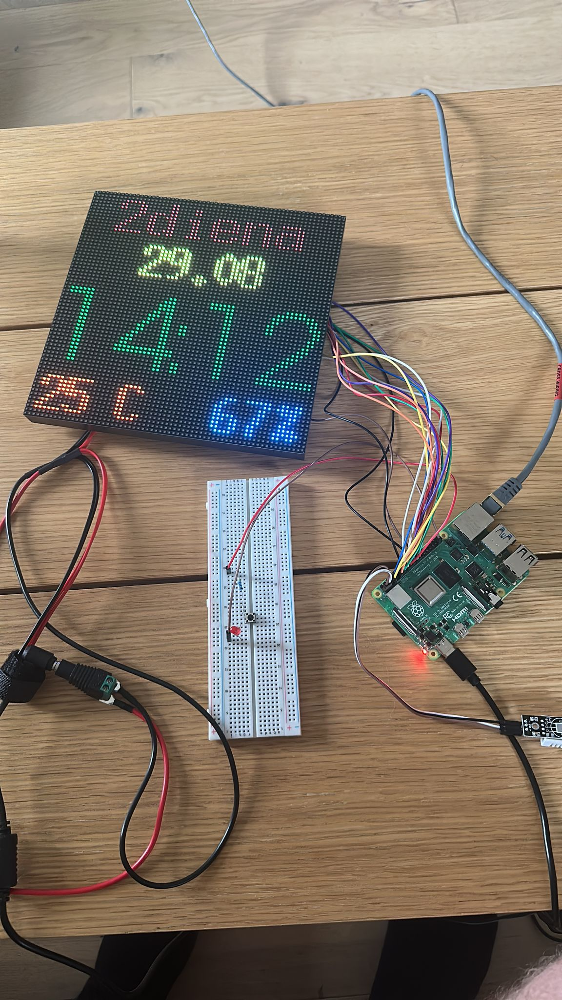

# Raspberry Pi LED matrix with DHT22 sensor and brightness button.

Navigate to the project directory and access the src folder. Execute the make command to build the program. Once the compilation is finished, run the executable by entering ./date_time_temp in the src folder.
